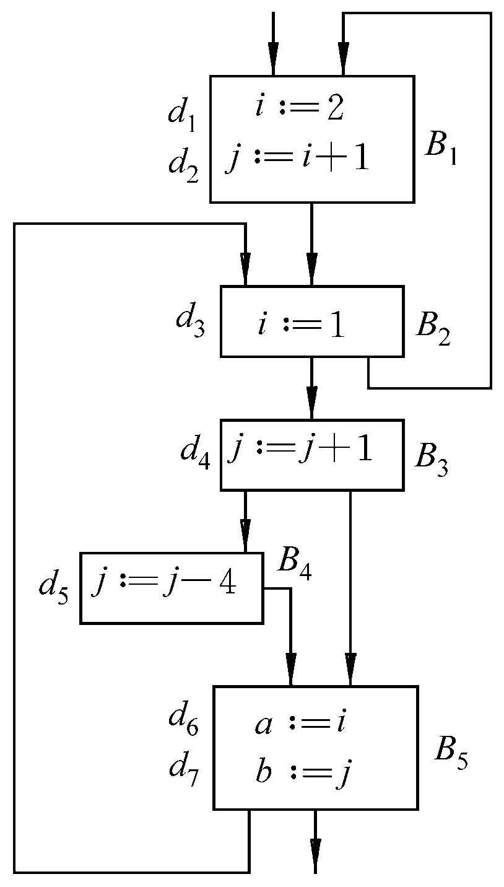

# 编译原理 PA 4 实验报告

计63 陈晟祺 2016010981

## 实验简述

本阶段的实验要求是基于对三地址码（TAC）的数据流分析，实现 Decaf 编译器后端的 DU（定制-引用） 链求解功能。提供的框架中，提供了基本块构建、活跃变量分析的功能。本次的功能实现在此基础上实现。

## 主要工作

根据课件 2.4.2 中的内容，对于代码块 $B$，计算DU链需要的内容是 $B$ 中所有的变量引用点 $Ref_{DU}[B]$、定值点 $Def_{DU}[B]$，以及在离开 $B$ 时在其后继块的变量引用点 $LiveOut_{DU}[B]$，这两者都可以记为 $(v, s)$ 的集合形式，其中 $v$ 是变量，$s$ 是 TAC 语句标号。

其中 $Ref_{DU}, Def_{DU}$在扫描时可以直接记录，$LiveOut_{DU}$ 满足与求解活跃变量相同的后向数据流方程，即：
$$
\begin{equation}
\label{equation:liveness}
LiveIn_{DU}[B]=LiveUse_{DU}[B]\cup(LiveOut_{DU}[B]-Def_{DU}[B]) \\
LiveOut_{DU}[B]=\bigcup_{b\in S[B]}(LiveIn_{DU})
\end{equation}
$$

一旦求解了上述方程，可以如下确定在任意定值点 $(v_0, s_0)\in Def_{DU}[B]$ 处的 DU 链：
$$
\DeclareMathOperator*{\argmin}{arg\,min}
\begin{equation}
\label{equation:du_chain}
DU(v_0, s_0) = 
\begin{cases}
\{s:(v_0, s) \in Ref_{DU}[B], s_0 < s \leq s_1\}~, \exists s_1=\min\{s:(v_0, s) \in Def_{DU}[B], s > s_0\}\\
\{s:(v_0, s) \in Ref_{DU}[B], s > s_0\} \cup \{s:(v_0, s) \in LiveOut_{DU}[B]\} ~,\text{otherwise}
\end{cases}
\end{equation}
$$
在代码的实现上，我在 `BasicBlock` 类中添加了 `defDU`, `reference`, `liveInDU`, `liveOutDU`, `liveUseDU` 五个 `<Temp, Integer>` 的集合，即表示上述的各个集合。在基本块的 `computeDefAndLiveUse` 方法中，添加对 `liveUseDU` 和 `defDU` 的初始化，即添加所有定值点，和之前未曾定值的变量的引用点。而后即可使用方程 $(\ref{equation:liveness})$ 的求解算法进行迭代，即 `FlowGraph`中的 `analyzeDUChain` 方法，其自 `analyzeLiveness`方法修改而来：除了将对应的集合换成带 `DU` 后缀的以外，其中从 `liveOut` 移除所有 `def` 内容的部分，也需要修改为从 `liveOutDU` 移除所有其 `temp` 属性包含于在 `defDU` 中所有元素的 `temp` 的属性集合中的元素。在方程求解结束后，只需对每个定值点，根据方程 $(\ref{equation:du_chain})$ 给出的方法计算每个其 DU 链即可。而由于 `Pair` 对象在 `TreeSet` 中已经根据 `temp` 为主，`pos` 次之的比较方式排过序，因此只需要顺序遍历 `defDU`，就可以完成整个块中 DU 链的计算。

事实上，我们完全可以不添加这些这些多余的属性（除了 `reference`），而是直接在原有的不带 `DU` 后缀的属性基础上修改。原有的算法只记录每个变量的第一个定值/引用的位置，我们可以选择将其全部记录下来。注意到，方程 $(\ref{equation:liveness})$ 同时适用于活跃变量和 DU 链的分析过程，区别是前者只需要 `Temp` 的集合，后者还需要位置信息；而 `LiveUse` 和 `Def` 这两个基本块的固有属性，如果扩展定义为块中每一次出现的引用和定值，对活跃变量方程的解没有影响（从方程的第一个式子就能看出）。因此，只需要进行一次迭代，事实上同时完成了 $LiveOut_{DU}[B]$ 和活跃变量两组方程的求解；而后继续计算 DU 链即可。考虑到目前要处理的程序并不复杂，为了清晰起见，我依旧选择将这两个流程分开处理。

除了对 `BasicBlock` 和 `FlowGraph` 上述的改动外，我还修改了 `Tac` 和 `Temp` 两个类，没有改变任何属性和逻辑，只是添加/使用了一些新的语言特性，以方便编码。

## 实例分析

由于课程直接给出了反向数据流方程组的解法，未加证明，我们也不予证明，直接承认。在此前提下，上述算法的正确性是非常直观的。

作为一个实际的例子，`t0.decaf` 的源码为：

```java
class Main {
    static void main() {
        f();
    }

    static void f() {
        int i;
        int j;
        int a;
        int b;
        a = 0;
        b = 1;

        bool flag;
        flag = false;

        i = 2;
        j = i + 1;
        
        while (flag) {
            i = 1;
            if (flag)
                f();

            j = j + 1;
            if (flag)
                j = j - 4;
            a = i;
            b = j;
        }
    }
}
```

分析输出的 TAC 序列与 DU 链信息共包含三个函数，如下所示：

### FUNCTION _Main_New

```
BASIC BLOCK 0 : 
1	_T0 = 4 [ 2 ]
2	parm _T0
3	_T1 =  call _Alloc [ 5 6 ]
4	_T2 = VTBL <_Main> [ 5 ]
5	*(_T1 + 0) = _T2
6	END BY RETURN, result = _T1
```

此函数比较简单，没有分支等结构，都是顺序执行。1 中 `_T0` 被定值，并只在 2 中被引用；3 中 `_T1` 被定值，并在 5 和 6 中被引用；4 中 `_T2` 被定值，并在 `5` 中被引用。其中没有出现覆盖定值等现象。

### FUNCTION main

```
BASIC BLOCK 0 : 
7	call _Main.f
8	END BY RETURN, void result
```

此函数没有定值点，因此也没有 DU 链。

### FUNCTION _Main_f

```
BASIC BLOCK 0 : 
9	_T7 = 0 [ 10 ]
10	_T5 = _T7 [ ]
11	_T8 = 1 [ 12 ]
12	_T6 = _T8 [ ]
13	_T10 = 0 [ 14 ]
14	_T9 = _T10 [ 21 24 30 ]
15	_T11 = 2 [ 16 ]
16	_T3 = _T11 [ 18 ]
17	_T12 = 1 [ 18 ]
18	_T13 = (_T3 + _T12) [ 19 ]
19	_T4 = _T13 [ 28 ]
20	END BY BRANCH, goto 1

BASIC BLOCK 1 : 
21	END BY BEQZ, if _T9 = 
	    0 : goto 7; 1 : goto 2
        
BASIC BLOCK 2 : 
22	_T14 = 1 [ 23 ]
23	_T3 = _T14 [ 35 ]
24	END BY BEQZ, if _T9 = 
	    0 : goto 4; 1 : goto 3
	    
BASIC BLOCK 3 : 
25	call _Main.f
26	END BY BRANCH, goto 4

BASIC BLOCK 4 : 
27	_T15 = 1 [ 28 ]
28	_T16 = (_T4 + _T15) [ 29 ]
29	_T4 = _T16 [ 28 32 36 ]
30	END BY BEQZ, if _T9 = 
	    0 : goto 6; 1 : goto 5
	    
BASIC BLOCK 5 : 
31	_T17 = 4 [ 32 ]
32	_T18 = (_T4 - _T17) [ 33 ]
33	_T4 = _T18 [ 28 36 ]
34	END BY BRANCH, goto 6

BASIC BLOCK 6 : 
35	_T5 = _T3 [ ]
36	_T6 = _T4 [ ]
37	END BY BRANCH, goto 1

BASIC BLOCK 7 : 
38	END BY RETURN, void result
```

与讲义中对应，我们可以知道定值点 $d_1$ 为语句 16，$d_2$ 为语句 19，$d_3$ 为语句 23，$d_4$ 为语句 29，$d_5$ 为语句 33，$d_6$ 为语句 35，$d_7$ 为语句 36。下面我们也使用这一对应关系，构建出的基本块的流图为（注：此流图与代码的流图略有不一致，省略了返回/递归/跳转等不重要的基本块，只保留了定值点，但没有改变基本块的连接关系）：



* $d_1$ 的定值在 $d_2$ 被引用，然后在 $d_3/d_1$ 被覆盖，因此其 DU 链仅有 $d_2$。

* $d_2$ 的定值可能在 $d_4$ 被引用同时覆盖，因此其 DU 链仅有 $d_4$。

* $d_3$ 的定值可能被 $d_1$ 覆盖，或者被 $d_7$ 引用然后返回/被覆盖（$d_3$），因此其 DU 链仅有 $d_7$。

* $d_4$ 的定值可能在 $d_5$ 被引用并同时被覆盖，或者在 $d_7$ 被引用后返回/被覆盖（$d_2$），或者在 $d_7$ 被引用后，在 $d_4$ 被引用然后同时被覆盖，因此其 DU 链为 $\{d_4, d_5, d_7\}$。

* $d_5$ 的定值可能在 $d_7$ 被引用然后返回/被覆盖（$d_2$），或者进一步在 $d_4$ 被引用然后覆盖 

* $d_6, d_7$ 的定值点没有被进一步引用，因此它们的 DU 链是空的。

分析的结果与讲义中给出的是一致的，而将各个定值点替换为相应点语句编号，可以看到我们求得的 DU 链与此是一致的，因此算法的正确性得到了验证。

需要说明的是，TAC 序列中剩余的定值点大多为存放立即数的临时变量，或者没有被改变的循环条件（`flag`）。由于没有被重新定值，它们的 DU 链是平凡的，都是流图中它们能够到达的并且引用它们的值的点。我们不再对其加以过多的分析。